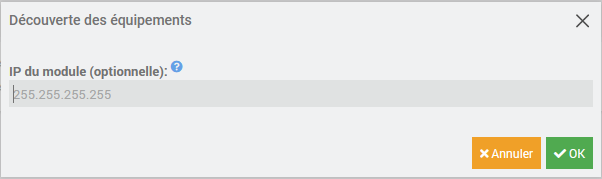

# Plugin Refoss EM

## Description

With this plugin, you can retrieve data from your Refoss energy monitors via the local network.

It retrieves the voltage, current, power, power factor and total consumption of each channel.

No connection to the Refoss cloud is required.

This plugin enables automatic detection on the local network.

## Pre-Requisites
- Connect your Refoss energy monitors to your network
- Assign them a fixed IP address to avoid having to reconfigure the equipment if the IP address changes.

## Installation

- Download the plugin from the market
- Activate the plugin
- Dependencies should start to be installed unless automatic management has been deactivated beforehand.

## Configuration

- **Update cycle** : Frequency of data recovery of voltage, power, ...
- **Internal socket port** : Only change this value if you have a conflict with another plugin.

## Equipment

The equipment can be accessed from the Plugins → Energy → Refoss EM menu.

### Discover the equipment

From the equipment configuration page, click on the Discover button.

If necessary, enter the IP address of the energy monitor. This step is necessary if it is not on the same subnet as Jeedom.

This stage can take up to 30 seconds. A message will inform you of the result of the discovery.

### Commands

For each equipment, you have the following information commands for each channel:
- Voltage in Volt
- Current in Amps
- Power in Watt
- Power factor
- Total consumption in kWh